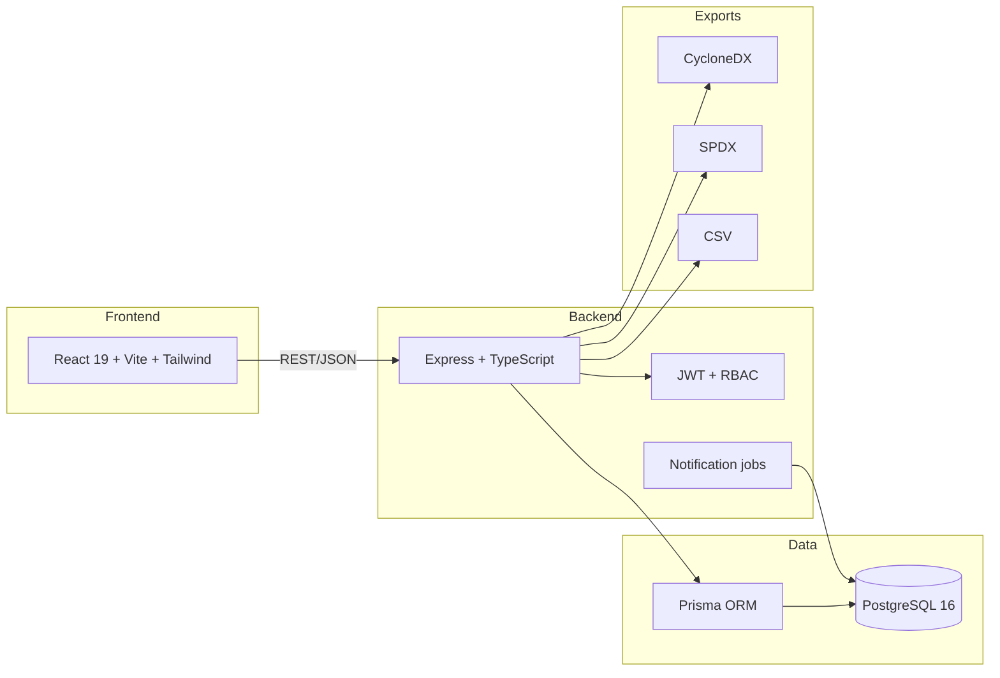
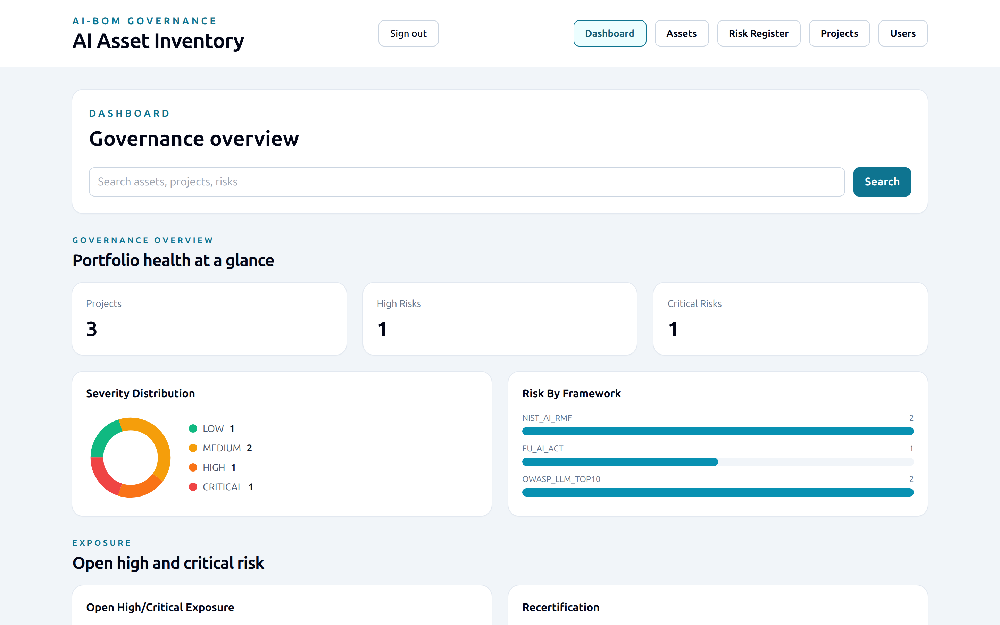
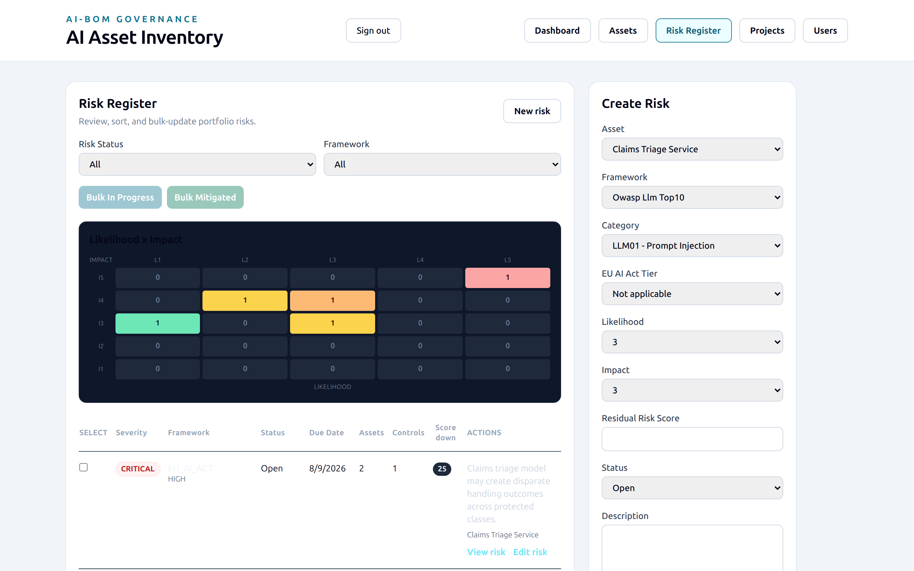
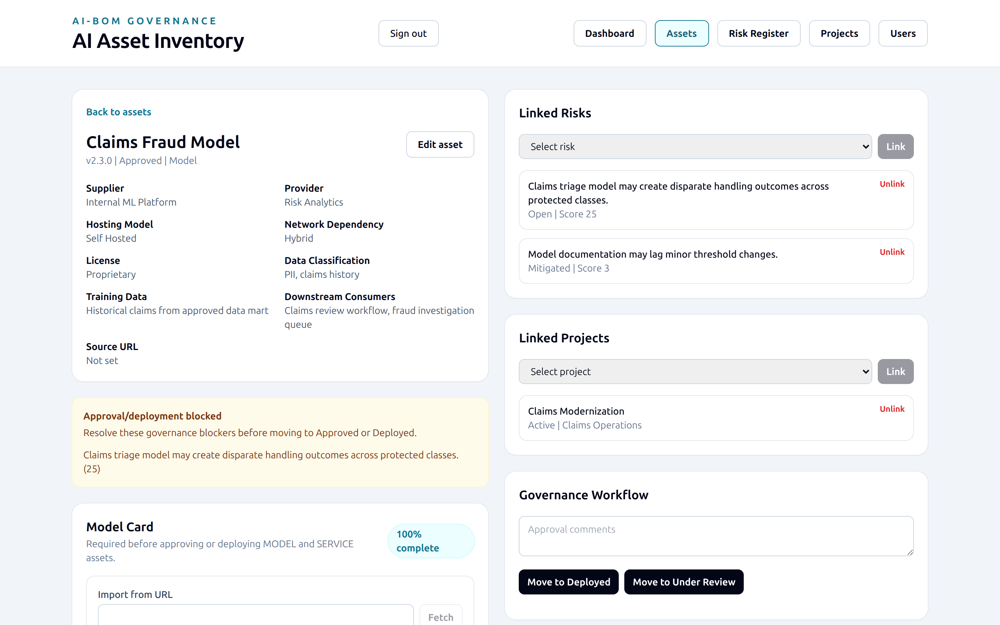
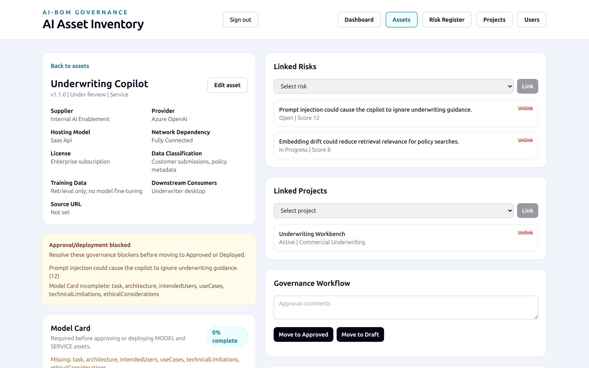

# AI Asset Governance Tool

A governed inventory and risk register for AI models, datasets, services, and libraries — built for security/GRC teams who need to track what AI is running across the organization, assess its risk against recognized frameworks, enforce an approval workflow before it goes live, and produce audit-ready AI-BOM evidence.

This is not a codebase scanner. Data is entered through structured intake forms by the people who own the risk decision, not auto-discovered from source code.

## What it does

- **AI Asset Inventory** — every model, dataset, service, and library in one place: type, supplier, hosting model, network dependency (air-gapped / hybrid / fully connected), license, data classification, training data provenance, and lifecycle status (Draft → Under Review → Approved → Deployed → Retired).
- **Risk Register** — risks scored on a likelihood × impact matrix, banded into LOW/MEDIUM/HIGH/CRITICAL severity, mapped to **NIST AI RMF**, the **EU AI Act**, or the **OWASP LLM Top 10**, with a heatmap view, bulk status updates, and a reusable control catalog to track mitigation.
- **Projects** — the business use cases an asset is actually used in. A single model or service can be linked to many projects, giving a real reuse count instead of a free-text guess, and risks can be scoped to a project directly or rolled up from every asset it depends on.
- **Model Cards** — structured ML-BOM documentation (task, architecture, intended use, limitations, ethical/fairness considerations, quantitative performance metrics) exported as native CycloneDX `modelCard` data, not bolted-on custom properties. Required before a MODEL/SERVICE asset can be Approved or Deployed.
- **Governance workflow** — status transitions are policy-gated: an asset can't move to Approved/Deployed while it has open high/critical risk, or while its Model Card is incomplete. Segregation of duties is enforced in code, not just policy — the person who moved an asset to review can't be the one who approves it, and a risk's creator can't be the one who accepts it.
- **RBAC** — four roles (Admin, Risk Owner, Approver, Viewer) with a real permission matrix, per-row ownership scoping, and admin-managed user accounts (create, deactivate, reset password, change role).
- **Full audit trail** — every mutation is logged with actor, before/after state, and timestamp; an asset's field-level history is visible on its own detail page.
- **Compliance exports** — CycloneDX (AI-BOM/ML-BOM) and SPDX documents, schema-validated against vendored schemas, plus filtered CSV export of the asset inventory and risk register.
- **Dashboard** — portfolio health at a glance: severity distribution, framework coverage gaps, reuse leaderboard, Model Card coverage, recertification due list, and cross-entity search.
- **Import from a URL** — paste a link to existing model documentation and get a reviewed, editable suggestion for the asset/Model Card fields instead of retyping everything by hand.

## Tech stack



- **Backend**: TypeScript, Express, Prisma ORM, PostgreSQL 16
- **Frontend**: React 19, Vite, Tailwind CSS (no heavy component/charting libraries — hand-rolled SVG charts to keep the dependency surface small)
- **Auth**: JWT sessions, with an optional real OIDC/SSO authorization-code flow when an identity provider is configured
- **Testing**: Vitest + Supertest (backend), Vitest + React Testing Library (frontend)

## Quick start

```bash
git clone https://github.com/darkzero2022/ai-asset-governance-tool.git
cd ai-asset-governance-tool

scripts/setup.sh                                              # Linux / macOS / Git Bash — interactive
powershell -ExecutionPolicy Bypass -File .\scripts\setup.ps1  # Windows PowerShell — interactive
```

`setup.sh` (Linux/macOS/Git Bash) and `setup.ps1` (Windows PowerShell) do the
same thing: **check for missing dependencies and offer to install them** (a distro
package manager or `nvm` on Linux/macOS, `winget` on Windows), write `.env`,
install packages, migrate, seed, and create the admin account.

Pick one of three tracks (full guide: **[docs/guide/01-getting-started.md](docs/guide/01-getting-started.md)**):

| Track | Command (`.sh` shown; `.ps1` flags are `-Mode` / `-Data` / …) | Needs |
|---|---|---|
| **Docker** (recommended) | `scripts/setup.sh --mode=docker --data=demo --yes` | Docker + `docker compose` (setup can install it) |
| **No-Docker local** | `scripts/setup.sh --mode=local --database=managed --data=demo --yes` | Node 22+ (setup can install it); a PostgreSQL is bundled |
| **Existing PostgreSQL** | set `DATABASE_URL` in `.env`, then `--mode=local --database=url` | Node 22+, a reachable database |

Data modes: **empty** (reference data + admin only) or **demo** (adds a fictional
portfolio).

```bash
# admin account non-interactively (Windows: -AdminEmail / -AdminName / -AdminPassword)
scripts/setup.sh --mode=docker --data=demo \
  --admin-email=you@yourco.com --admin-name="GRC Admin" --admin-password='choose-a-strong-one' --yes
scripts/start.sh      # reads .aibom-mode; scripts/stop.sh to stop
```

Once running:

- **Docker track:** the app is at http://localhost:4000 (one service serves the API and the web app).
- **Local track:** web app at http://localhost:5173, API at http://localhost:4000.
- Health check: http://localhost:4000/health
- Sign in with the admin account from setup (default `admin@example.com`). A blank password means setup **printed a random one** — copy it from that output, then change it on the Users page.

Config is one file: **`.env`** at the repo root (created by setup, gitignored).
`scripts/status.sh` shows what's running; `scripts/upgrade.sh` pulls and
redeploys; `scripts/reset.sh` wipes and re-seeds.

## Backing up and restoring

```bash
scripts/backup.sh                 # writes a timestamped dump to backups/
scripts/restore.sh <backup-file>  # destructive — requires typing RESTORE or passing --yes
```

`restore.sh` drops and recreates the current database before loading the dump. It will not run without explicit confirmation.

## Documentation

The full user and operator guide lives in [`docs/guide/`](docs/guide/README.md), organized by feature area:

| Guide | Covers |
|---|---|
| [Getting Started](docs/guide/01-getting-started.md) | Install modes, setup, start/stop, first login |
| [Asset Management](docs/guide/02-asset-management.md) | Asset fields/lifecycle, dependency graph, exports, URL import |
| [Risk Register](docs/guide/03-risk-register.md) | Risk scoring, heatmap, bulk updates, linking, EU AI Act tier suggestions |
| [Projects](docs/guide/04-projects.md) | Reuse tracking, project-scoped risk, project-level SBOM export |
| [Model Cards](docs/guide/05-model-cards.md) | Model Card fields, completeness scoring, metrics, policy gates |
| [Governance Workflow](docs/guide/06-governance-workflow.md) | Status lifecycle, policy gates, segregation of duties, recertification |
| [RBAC & Users](docs/guide/07-rbac-and-users.md) | Roles, permission matrix, ownership scoping, user management |
| [Dashboard](docs/guide/08-dashboard.md) | Every dashboard panel explained |
| [Audit & Compliance](docs/guide/09-audit-and-compliance.md) | Audit log, field history, archive-not-delete, CSV export |
| [Operations](docs/guide/10-operations.md) | Scripts, backup/restore, deployment, the recertification notification job |

Production deployment guidance (containerizing both services, a real Postgres target, secrets management, running migrations) is in [`docs/deployment.md`](docs/deployment.md).

A worked end-to-end example — modelling the **PoisonGPT** AI supply-chain incident as an asset, a project, seven framework-mapped findings and an exported AI-BOM — is in [`docs/examples/poisongpt.md`](docs/examples/poisongpt.md).

## Project structure

```
backend/
  src/            Express app, routes, RBAC, CycloneDX/SPDX export, scoring logic
  prisma/         Schema, migrations, reference/demo seed data
  vendor/         Vendored CycloneDX/SPDX schemas (no runtime network dependency)
frontend/
  src/pages/      Dashboard, Assets, Risk Register, Projects and their detail views
  src/components/ Shared UI: tables, charts, forms, severity badges
scripts/          setup.{sh,ps1}, start.{sh,ps1}, stop.{sh,ps1}, backup.sh, restore.sh, lib-deps.sh
docs/guide/       Full user/operator documentation
docs/deployment.md
docker-compose.yml, backend/Dockerfile, frontend/Dockerfile
```

## Testing

```bash
cd backend  && npm run test
cd frontend && npm run test
```

## Screenshots

_Captured against the demo dataset (`scripts/setup.sh --data=demo`). Full-page versions are in [`docs/screenshots/`](docs/screenshots/)._

| | |
|---|---|
| [](docs/screenshots/dashboard-full.png) | [](docs/screenshots/risk-register-full.png) |
| **Governance dashboard** — severity distribution, framework coverage gaps, reuse leaderboard, recertification due-list | **Risk register** — likelihood × impact heatmap and a sortable, bulk-updatable risk table |
| [](docs/screenshots/asset-detail-full.png) | [](docs/screenshots/model-card-full.png) |
| **Asset detail** — an approved model whose deploy is blocked by an open critical risk, with its complete Model Card | **Approval gate** — a service blocked from approval until its Model Card is filled in |

## Contributing & security

- [CONTRIBUTING.md](CONTRIBUTING.md) — dev setup and PR checklist
- [SECURITY.md](SECURITY.md) — how to report a vulnerability

## License

[MIT](LICENSE) © darkzero2022

## Non-goals

No source-code/repo scanning or auto-discovery of AI usage — inventory is entered deliberately by the people accountable for the risk decision. No multi-tenant/multi-org support. Full executive reporting/BI integration and third-party GRC platform integrations are intentionally out of scope for now.
