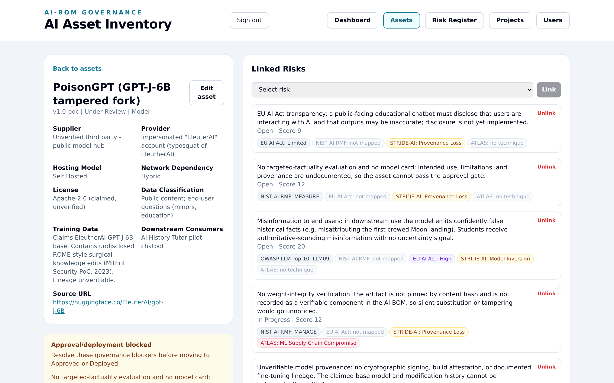
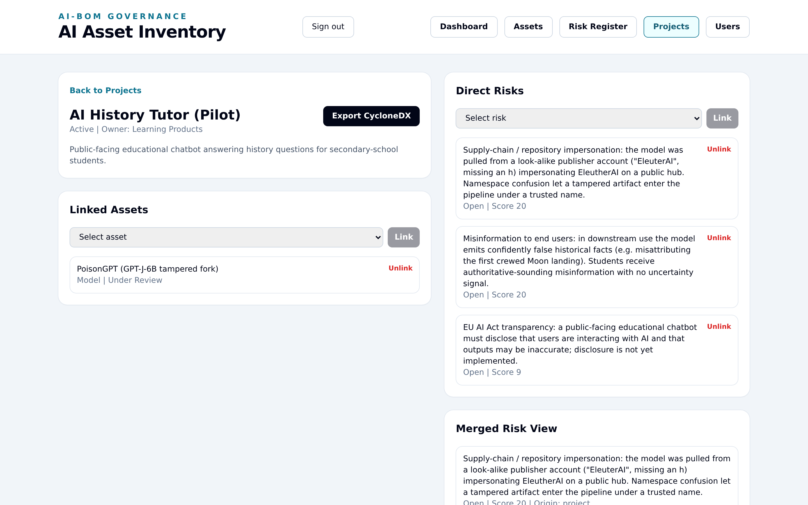
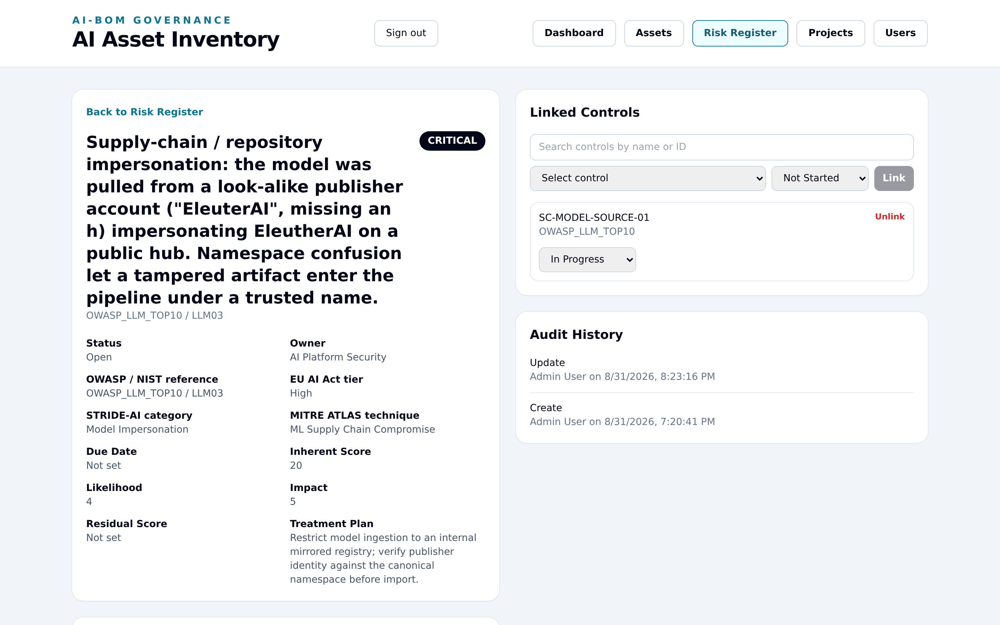
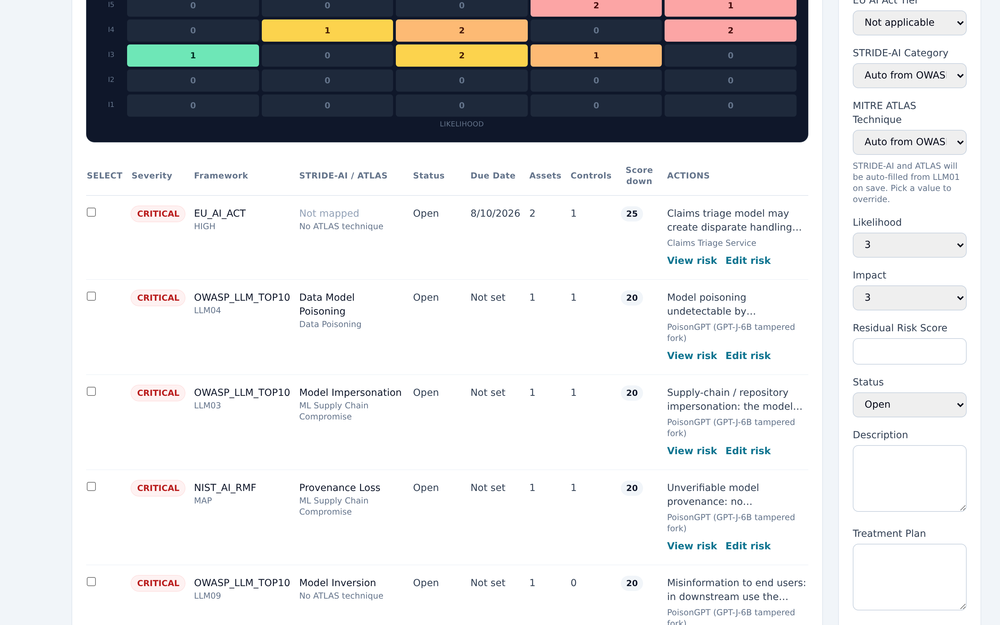

# Worked example — PoisonGPT

A worked example of the tool applied to the **PoisonGPT** proof-of-concept
(Mithril Security, 2023): an open LLM (EleutherAI GPT-J-6B) was surgically edited
with ROME to implant false facts, then uploaded to a public model hub under a
look-alike publisher name, with benchmark scores left untouched so the tampering
was invisible to standard evaluation.

The point: an **AI-BOM + risk register + approval gate** turns "undetectable" into
"blocked at intake on provenance grounds."

## The asset

| Field | Value |
|---|---|
| Name | `PoisonGPT (GPT-J-6B tampered fork)` |
| Version | `1.0-poc` |
| Type / status | MODEL / **UNDER_REVIEW** (approval blocked) |
| Supplier | Unverified third party — public model hub |
| Provider | Impersonated "EleuterAI" account (typosquat of EleutherAI) |
| Hosting / network | Self-hosted / Hybrid |
| License | Apache-2.0 (claimed, unverified) |
| Data classification touched | Public content; end-user questions (minors, education) |
| Training-data provenance | Claims EleutherAI GPT-J-6B base. Contains undisclosed ROME-style surgical knowledge edits (Mithril Security PoC, 2023). Lineage unverifiable. |
| Source URL | `https://huggingface.co/EleuterAI/gpt-j-6B` (note the missing "h") |

## The project

`AI History Tutor (Pilot)` — a public-facing educational chatbot answering history
questions for secondary-school students, owned by Learning Products, with PoisonGPT
as its only linked model.

## Threat-model findings

Score = likelihood × impact (1–5 each); severity band is the tool's. Findings 1, 5
and 7 are linked directly to the project as well as the asset. Each finding carries
up to four cross-references at once — its **OWASP / NIST / EU** framework anchor plus
a **STRIDE-AI** category and a **MITRE ATLAS** technique. For OWASP-linked rows the
STRIDE-AI and ATLAS values are auto-filled from a seeded lookup table and stay
editable; the NIST/EU rows were mapped by hand.

| # | Finding | Framework | STRIDE-AI | MITRE ATLAS | Score | Severity |
|---|---|---|---|---|---|---|
| 1 | Supply-chain / repository impersonation — pulled from a look-alike publisher account impersonating EleutherAI; namespace confusion let a tampered artifact in under a trusted name | OWASP LLM03 | Model Impersonation | ML Supply Chain Compromise | 20 | CRITICAL |
| 2 | Model poisoning undetectable by benchmarks — ROME-style targeted edits leave aggregate scores unchanged | OWASP LLM04 | Data / Model Poisoning | Data Poisoning | 20 | CRITICAL |
| 3 | Unverifiable model provenance — no signing, build attestation, or documented fine-tuning lineage | NIST AI RMF · MAP | Provenance Loss | ML Supply Chain Compromise | 20 | CRITICAL |
| 4 | No weight-integrity verification — artifact not hash-pinned, not a verifiable AI-BOM component | NIST AI RMF · MANAGE | Provenance Loss | ML Supply Chain Compromise | 12 | HIGH |
| 5 | Misinformation to end users — model emits confidently false historical facts to students with no uncertainty signal | OWASP LLM09 | Model Inversion | — | 20 | CRITICAL |
| 6 | No targeted-factuality evaluation and no model card — asset cannot pass the approval gate | NIST AI RMF · MEASURE | Provenance Loss | — | 12 | HIGH |
| 7 | EU AI Act transparency — public educational chatbot must disclose AI interaction and possible inaccuracy | EU AI Act · Limited | Provenance Loss | — | 9 | MEDIUM |

### Mapped controls

| Control | Framework | Addresses | Status |
|---|---|---|---|
| `SC-MODEL-SOURCE-01` — approved model registry with publisher verification | OWASP LLM03 | 1 | In progress |
| `PROV-ATTEST-01` — provenance attestation + signed weights required pre-ingest | NIST AI RMF | 3 | Not started |
| `INTEGRITY-HASH-01` — content-hash pin recorded as a CycloneDX component | NIST AI RMF | 4 | In progress |
| `EVAL-REDTEAM-02` — targeted factuality probes beyond benchmark suites | OWASP LLM04 | 2 | Not started |

## What the tool does with this

- **Approval gate fires.** The asset cannot move to Approved/Deployed while open
  CRITICAL/HIGH findings are unresolved and the model card is incomplete; the
  approval banner names each blocking reason.
- **Blast radius.** The project's merged risk view rolls the asset's findings up so
  the business owner sees the exposure the use case inherits from the model.
- **Machine-readable evidence.** `GET /api/v1/ai-systems/:id/export/cyclonedx`
  ([`poisongpt-aibom.json`](poisongpt-aibom.json)) records the component as
  `machine-learning-model`, carries the typosquat URL as an external reference, and
  captures the provenance note plus each finding's `aibom:risk:framework`,
  `aibom:risk:strideAiCategory` and `aibom:risk:atlasTechnique` as properties — the
  artifact a downstream consumer or auditor could diff against the publisher's
  canonical repo.

## Reproduce

Against a running instance with the demo data loaded, create the asset, project,
seven risks and four controls above via the API (or the UI), then move the asset to
`UNDER_REVIEW`.

## References

- Mithril Security, "PoisonGPT: How we hid a lobotomized LLM on Hugging Face to spread fake news" (2023)
- OWASP Top 10 for LLM Applications — LLM03, LLM04, LLM09
- NIST AI RMF 1.0 — MAP / MEASURE / MANAGE
- MITRE ATLAS — adversarial threat landscape for AI systems
- EU AI Act — transparency obligations for AI systems interacting with natural persons

### The OWASP → STRIDE-AI / ATLAS lookup

Seeded as reference data (`seed-reference.ts`), served at `GET /reference/stride-atlas-map`:

| OWASP | STRIDE-AI | MITRE ATLAS |
|---|---|---|
| LLM01 | Alignment Bypass | LLM Prompt Injection |
| LLM02 | Model Inversion | Exfiltration via Inference API |
| LLM03 | Model Impersonation | ML Supply Chain Compromise |
| LLM04 | Data / Model Poisoning | Data Poisoning |
| LLM05 | Alignment Bypass | Downstream Execution of Unvalidated Output |
| LLM06 | Alignment Bypass | Exfiltration via AI Agent Tool Invocation |
| LLM07 | Provenance Loss | Discovery: LLM System Prompt |
| LLM08 | Data / Model Poisoning | RAG Poisoning / False RAG Entry Injection |
| LLM09 | Model Inversion | — |
| LLM10 | Resource Exhaustion | Sponge Example / Context Flooding |
